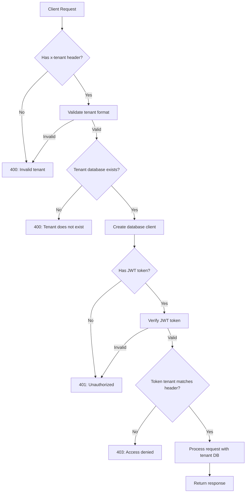

# Multi-tenant application with Turso

This project demonstrates how to build a multi-tenant application using Turso as the database provider. Each tenant gets their own isolated database, ensuring complete data separation and security.

## How multi-tenancy works

### Request flow

### Database-per-tenant architecture

This application uses a **database-per-tenant** approach where each tenant gets their own dedicated Turso database. This provides:

- Complete data isolation between tenants
- Independent scaling per tenant
- Simplified backup and recovery
- No cross-tenant data leakage risks

### Tenant identification

Tenants are identified through the `x-tenant` header in HTTP requests. The system validates this header and routes requests to the appropriate database.

### Database lifecycle

1. **Tenant creation**: When a new tenant is created via `POST /tenants`, the system:

   - Validates the tenant name (lowercase, alphanumeric, dashes only)
   - Creates a new Turso database with the tenant name
   - Runs database migrations to set up the schema
   - Creates the first admin user for that tenant

2. **Request processing**: For each authenticated request:
   - Extracts the tenant ID from the `x-tenant` header
   - Validates the tenant exists in Turso
   - Creates a database client connection to the tenant's database
   - Attaches the database client to the request object

## Architecture components

### Plugins

The application uses three Fastify plugins to handle multi-tenancy:

#### `tenantPlugin` (`src/plugins/tenant.ts`)

- Validates the `x-tenant` header on every request
- Checks if the tenant database exists in Turso
- Creates a database client for the tenant
- Attaches both `tenant` and `db` to the request object
- Enforces tenant isolation by validating user-tenant relationships

#### `authPlugin` (`src/plugins/auth.ts`)

- Handles JWT token verification
- Protects routes that require authentication

## Security model

### Tenant isolation

- Each tenant has a completely separate database
- Users can only access data within their assigned tenant
- JWT tokens include tenant information to prevent cross-tenant access
- The `tenantPlugin` validates that authenticated users belong to the correct tenant

### Authentication flow

1. User signs in with username/password within their tenant context
2. System validates credentials against the tenant's database
3. JWT token is issued containing both `userId` and `tenant`
4. Subsequent requests must include both the JWT token and `x-tenant` header
5. System validates that the token's tenant matches the header's tenant
